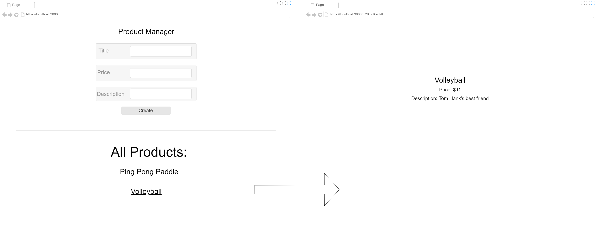

# Javascript_React_Products_manager
<h2>
A full stack MERN application for product management
</h2>

- [x] 	Create MERN stack folder structure
- [x] 	Create server, model, controller, routes, and config files for your server
- [x] 	On the client end ==> Create a form component so that Product can have a title, price and description
- [x] 	Check in database that your products are being added
- [x] 	Create a component to list out all products on your main page
- [x] 	Create a new view component that will let you see the details of a particular product (localhost:3000/:id)
- [x] 	Link to the detail page in the list of products
- [x] 	Add the route localhost:3000/:id/edit that will include an autofilled form to edit a given product.
- [x] 	Add a delete button in the List component as well as the detail component that will delete the product from the database
- [x] 	After deleting the product from the Detail component, redirect to the main view
- [x] 	After deleting the product from the main view, update the DOM so that the product is removed.

